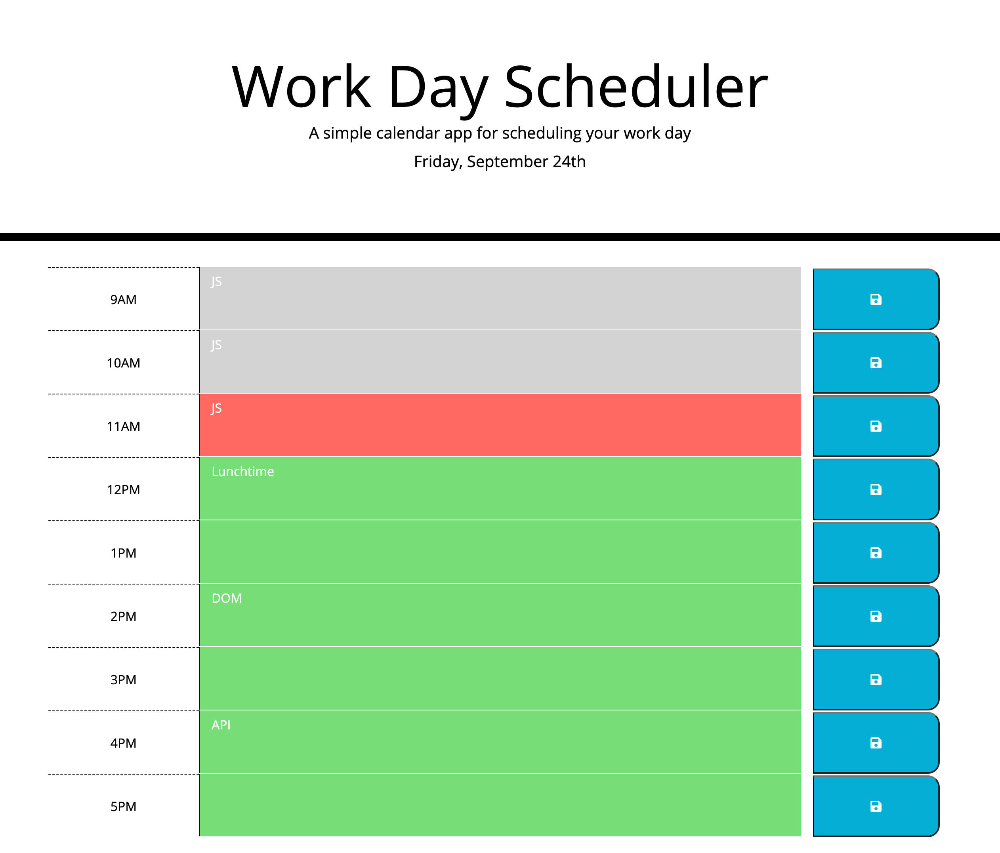

# Work-Day-Scheduler

## Description

In this project, my task is to build a work day scheduler to display daily schedule for each hour.

## Requirements

1. Current say is displayed at the top of the calendar.
2. Scheduler presented with timeblocks for standard business hours.
3. Using save button to save event for each hour.
4. Event is saved in local storage.
5. When refresh the page, saved events persist.

## Link URL for GitHub Repo

https://github.com/jingwang6028/Work-Day-Scheduler

## Link URL for GitHub Page

https://jingwang6028.github.io/Work-Day-Scheduler/

## Mock-up picture

This picture shows the application's appearance and functionality.

